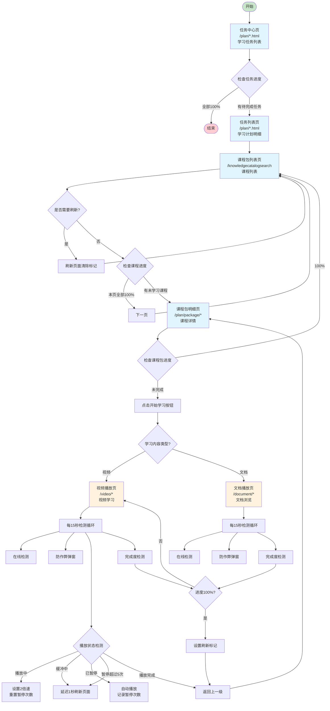
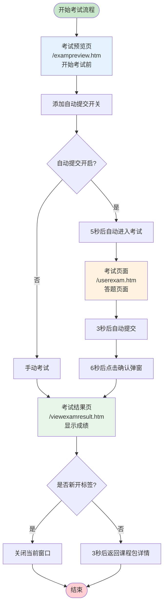
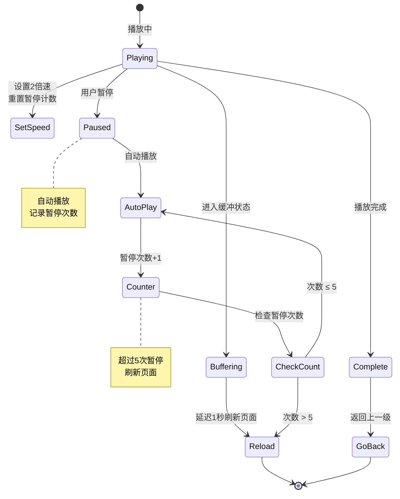
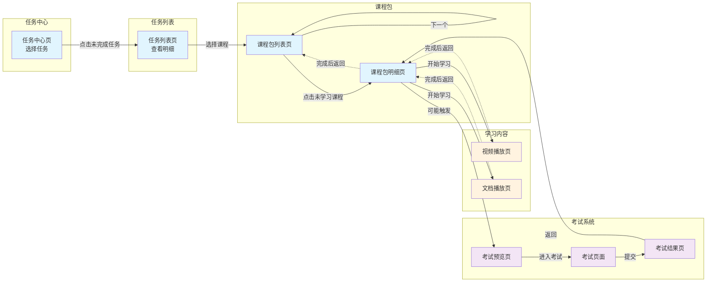
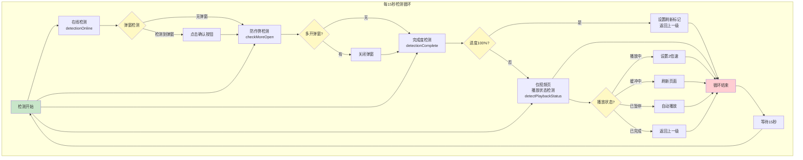

# 云学堂自动学习脚本 - 页面关系流程图 (Mermaid版)

## 主学习流程

## 考试流程

## 视频播放状态检测详细流程

## 页面跳转关系图

## 关键检测循环机制

## URL匹配规则

| 页面类型 | 匹配模式 | 代码行数 | 说明 |
|---------|---------|---------|------|
| 任务列表页 | `^\/plan.*` | 54-69 | 选择未完成任务 |
| 文档播放页 | `^\/kng\/.*\/document.*` | 71-82 | 文档学习页面 |
| 视频播放页 | `^\/kng\/.*\/video.*` | 84-99 | 视频学习页面 |
| 课程包明细页 | `^\/kng\/\w*\/package.*` | 100-115 | 课程包详情 |
| 课程包列表页 | `^\/kng\/knowledgecatalogsearch.*` | 116-152 | 课程包列表 |
| 签到页 | `^\/sty.*` | 153-157 | 自动签到 |
| 考试预览页 | `^\/exam\/exampreview.*` | 158-265 | 开始考试 |
| 考试页面 | `^\/exam\/test\/userexam.*` | 269-286 | 答题页面 |
| 考试结果页 | `^\/exam\/viewexamresult.*` | 289-304 | 考试结果 |

## 核心存储键值

| 键名 | 说明 | 用途 |
|-----|------|------|
| `auto_submit` | 自动提交考试 | 控制是否自动提交考试 |
| `kng_href_key` | 课程包URL | 保存当前课程包地址用于返回 |
| `course_package_refresh_key` | 刷新标记 | 标记是否需要在列表页刷新 |
| `exam_open_page_key` | 新开标签标记 | 判断考试是否在新标签打开 |
| `numberOfVideoPlaybackPauses` | 暂停次数 | 记录视频暂停次数，超过5次刷新 |
